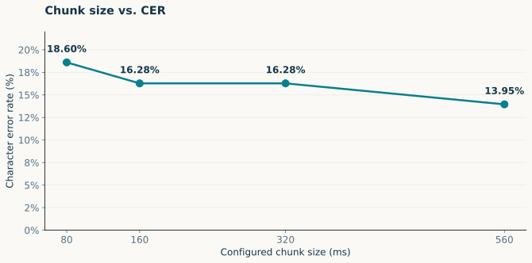
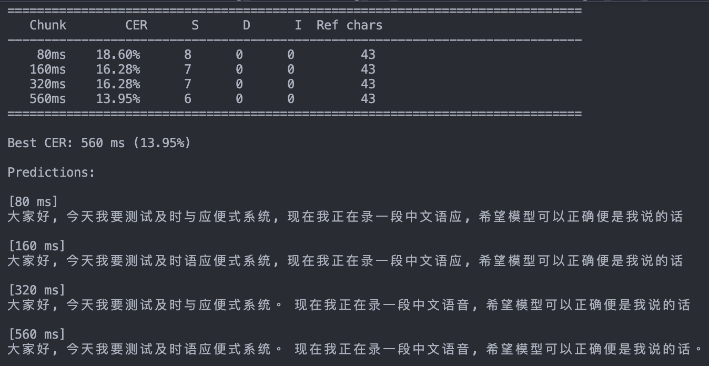

## 這次實驗在問什麼？

::: {.lead}
同一段中文音訊， 改變 chunk 設定，辨識品質如何變化？
:::

- **研究對象**：Nemotron 3.5 串流語音辨識模型。
- **比較設定**：80、160、320、560 ms。
- **評估指標**：字元錯誤率 CER；本次尚未測量實際延遲。

::: {.source}
資料：既有實驗的終端截圖。本簡報整理既有結果，未重新執行 ASR 推論。
:::

::: {.notes}
**結論**：本次先看中文 ASR 品質如何隨 chunk 設定改變。

**例子**：四組結果使用相同的 reference 字元數 N = 43，後面會逐一比較。

**易混淆處**：目前是一段中文樣本的初步比較。尚未取得完整執行指令，因此其他條件是否完全固定仍待確認；也沒有實測延遲，不能視為完整的品質與延遲評估。
:::

## 模型定位與架構

::: {.lead}
語音輸入，同語言文字輸出。
:::

| 項目 | 模型卡中的描述 |
|---|---|
| **模型** | NVIDIA `nemotron-3.5-asr-streaming-0.6b` |
| **規模** | 約 6 億參數 |
| **架構** | Cache-aware FastConformer encoder（24 層） |
| **解碼與輸出** | RNN-T decoder＋語言提示；支援標點與大小寫 |

::: {.source}
來源：[NVIDIA 官方模型卡](https://huggingface.co/nvidia/nemotron-3.5-asr-streaming-0.6b)。原報告查閱日：2026-10-08。
:::

::: {.notes}
**結論**：這是串流語音辨識模型，輸出與語音同語言的文字。

**例子**：輸入中文語音，辨識結果是中文逐字稿。

**易混淆處**：模型規模、層數與架構來自原報告引用的官方模型卡，並非由本次截圖推得。模型本身不構成 MT 或完整的語音翻譯系統。
:::

## 中文支援與語言提示

| 官方支援分級 | Language-locales | 使用方式 |
|---|---:|---|
| Transcription-ready | 19 | 可直接轉錄 |
| Broad-coverage | 13 | 可直接轉錄；包含 Mandarin `zh-CN` |
| Adaptation-ready | 8 | 需要微調 |

- `target_lang=zh-CN`：指定辨識語言。
- `target_lang=auto`：自動辨識語言。

::: {.takeaway}
40 個 locales 不等於 40 種獨立語言。 官方支援表未單列 zh-TW，繁體輸出與台灣口音品質仍需驗證。
:::

::: {.source}
來源：[官方模型卡：語言支援與 NeMo 使用方式](https://huggingface.co/nvidia/nemotron-3.5-asr-streaming-0.6b)。
:::

::: {.notes}
**結論**：前兩類合計 32 個 locales 可直接轉錄；另外 8 個需微調。

**例子**：指定 target_lang=zh-CN 表示辨識 Mandarin，不代表把其他語言翻成中文。

**易混淆處**：Locale 不是獨立語言數。這次截圖未顯示執行指令，不能確定實際使用 auto 或 zh-CN。官方未單列 zh-TW，不能據此保證繁體文字或台灣口音的辨識品質。
:::

## 四組 chunk 的辨識結果



::: {.takeaway}

:::

::: {.source}
資料：原始截圖轉錄；表格與摘要由 data/chunk_results.csv 自動產生。
:::

::: {.notes}
**結論**：此次 560 ms 的 CER 最低。

**例子**：80 ms 是 8/43，560 ms 是 6/43；CER 從 18.60% 降到 13.95%。

**易混淆處**：下降 4.65 個百分點，與相對下降約 25% 是不同表示方法。相對降幅以未四捨五入的計數計算。只有一段樣本，不能推論 560 ms 在所有中文音訊上都最好。
:::

## Chunk 設定與 CER 的變化

{.diagram .result-chart alt="Chunk 設定為 80、160、320、560 ms 時，CER 分別為 18.60%、16.28%、16.28%、13.95%。"}

::: {.takeaway}
80 到 560 ms：S 從 8 降到 6；D 與 I 都維持 0。 本次 CER 的下降，來自少了 2 次替換錯誤。
:::

::: {.source}
橫軸是 chunk 設定，並非實測延遲；連線僅方便比較四個測試點。
:::

::: {.notes}
**結論**：本次差距來自替換錯誤數減少。

**例子**：160 與 320 ms 都是 7/43 = 16.28%，在圖上高度相同。

**易混淆處**：相同 CER 不表示辨識字串相同，原始截圖的兩組 predictions 仍有文字差異。圖中的連線不表示已測試中間所有設定；橫軸也不能拿來當實際字幕延遲。
:::

## 結果解讀與錄音品質限制

- **本次觀察**：560 ms 的 CER 最低；160 與 320 ms 的總錯誤數相同。
- **可能影響因素**：測試音檔可能含環境音；錄音品質對辨識錯誤的影響仍待確認。
- **解讀範圍**：目前無法分辨 chunk 設定與噪音的影響，也無法判定中文辨識的最佳設定。

::: {.takeaway}
先檢查原始音檔、標記環境音片段； 再以相同語音的乾淨／含噪版本，重測四組 chunk。
:::

::: {.source}
本次僅 43 個 reference 字元，差 1 次錯誤即約 2.33 個百分點。環境音影響為待驗證假設。
:::

::: {.notes}
**結論**：560 ms 在這段測試音檔的 CER 最低；音檔可能含環境音，因此結果應限定在目前樣本與錄音條件下解讀。

**可能因素**：使用者提出測試資料可能不夠乾淨、含背景環境音。目前尚未檢查原始音檔或量化噪音，不能把辨識錯誤直接歸因於環境音，也不能宣稱較大的 chunk 已證明更抗噪。較多右側上下文可能有助辨識，仍是待驗證的解釋。

**下一步**：先聽原始音檔並標記環境音與辨識錯誤的位置。若要分開比較噪音與 chunk 的影響，可另收集乾淨錄音，保留乾淨版本，再由同一錄音加入可控制的背景音製作含噪版本；兩個版本使用相同 reference、正規化與解碼設定，各測 80、160、320、560 ms。這是後續規劃，尚未執行。

**易混淆處**：若四組 chunk 確實使用同一音檔，環境音就是共同的輸入條件；不能僅因有環境音，就否定這次觀察到的排序。需要乾淨／含噪的對照，才有依據討論噪音是否改變各 chunk 的表現。另因 N = 43，差一次錯誤就約 2.33 個百分點，仍需更多樣本確認。
:::

## 原始實驗截圖

{.evidence-image alt="原始終端截圖：上方為四組 chunk 的 CER 與錯誤計數，下方為中文辨識 predictions。"}

::: {.source}
上方：CER 與錯誤計數。下方：各 chunk 的 predictions。 保留完整原圖供核對；模型假設文字不等於人工標準答案。
:::

::: {.notes}
**結論**：這張截圖是本次實驗數字的原始依據。

**例子**：可對照表格中的 N、S、D、I，以及 160 和 320 ms 的辨識字串差異。

**易混淆處**：不能直接用畫面上的字串猜 reference 長度，因為 reference 與正規化規則尚未提供。本報告未混入官方 benchmark 的結果。
:::

## 下一輪：固定條件與中文評分

1. **固定比較條件**：保存音檔、人工 reference、模型版本、語言提示與解碼設定，每次只改 chunk。
2. **統一正規化**：記錄繁簡轉換、標點、空白、數字及語言標籤的處理方式。
3. **增加樣本**：涵蓋不同講者、專有名詞、中英夾雜與長句。

::: {.takeaway}
多音檔評估以總錯誤數 ÷ 總 reference 字數回報 corpus CER。
:::

::: {.notes}
**結論**：先建立能重現、可比較的中文辨識評估。

**例子**：保存同一組音檔與人工答案，每輪只調整 chunk，其他設定固定。

**易混淆處**：不要從畫面上的 predictions 猜測 N。Corpus CER 用總錯誤數除以總參考字數，避免把不同長度音檔的 CER 直接等權平均而改變指標意義。
:::

## 下一輪：量測延遲與串接翻譯

| 觀察項目 | 要記錄的內容 |
|---|---|
| **首字延遲** | 音訊到達與首次文字輸出的時間 |
| **穩定提交延遲** | 文字何時成為穩定輸出 |
| **尾端延遲** | 音訊結束至最後輸出的時間 |
| **RTF** | 處理耗時 / 音訊時長 |

::: {.takeaway}
加入 MT 後，再評估中文到英文的翻譯品質與完整系統延遲。
:::

::: {.source}
以上為下一輪實驗規劃；RTF 無法替代使用者感受到的延遲。
:::

::: {.notes}
**結論**：下一輪需保存音訊與文字事件時間，並明確定義各種延遲。

**例子**：分別記錄首字出現、文字穩定提交，以及音訊結束後最後一段輸出的時間。

**易混淆處**：RTF 是運算效率的比值，不等於字幕延遲。加入 MT 後，ASR CER 仍只衡量辨識，必須另評估翻譯品質與全流程延遲。
:::

## 本次結論與下一步

::: {.lead}
560 ms 在此樣本的 CER 最低； 設定選擇仍需更多音檔與延遲證據。
:::

- **目前結果**：18.60% 降到 13.95%，少 2 次替換錯誤。
- **目前限制**：一段樣本、43 個 reference 字元、沒有實測延遲。
- **下一步**：固定評分方式，增加音檔並補上延遲記錄。

::: {.closing}
先確認辨識品質與等待時間，再決定翻譯系統的 chunk 設定。
:::

::: {.notes}
**Group meeting 口頭重點**：我這次測的是串流語音辨識，目標先看中文辨識品質如何隨 chunk 改變。四組結果中，560 ms 的 CER 最低，從 80 ms 的 18.60% 降到 13.95%，相當於少兩個替換錯誤。不過，目前只有一段樣本，而且還沒量實際延遲，所以我下一步會固定評分方式、增加音檔並補上延遲記錄，再決定接到即時翻譯系統時採用哪個設定。
:::

## 資料與參考來源

1. **使用者提供的終端截圖**：本次所有實驗數字的來源，未混入官方 benchmark。
2. **[NVIDIA 官方模型卡](https://huggingface.co/nvidia/nemotron-3.5-asr-streaming-0.6b)**：模型架構、語言支援與 chunk 設定。原報告查閱日：2026-10-08。
3. **[Noroozi et al., ICASSP 2024](https://arxiv.org/abs/2312.17279)**：*Stateful Conformer with Cache-based Inference for Streaming Automatic Speech Recognition*；arXiv 初稿 2023。

::: {.source}
架構研究作為 cache-aware 背景說明；不作為本次中文實驗結果的來源。
:::

::: {.notes}
資料界線：已核算截圖中的錯誤計數與 CER，但缺少音檔、人工 reference、正規化程式、實際延遲與完整執行環境。官方設定對照不等於已確認此次實際執行設定。
:::
