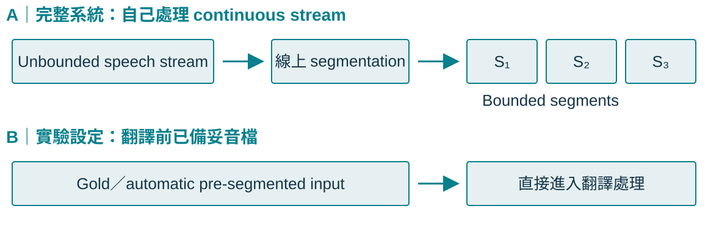
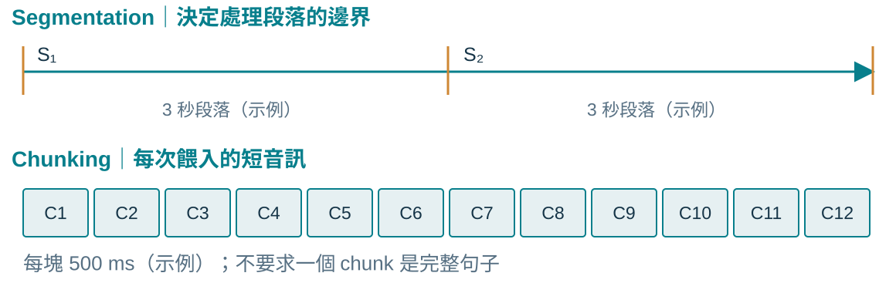
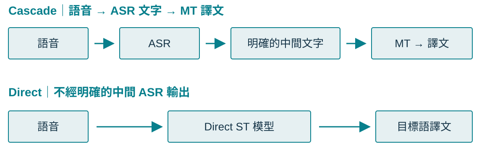
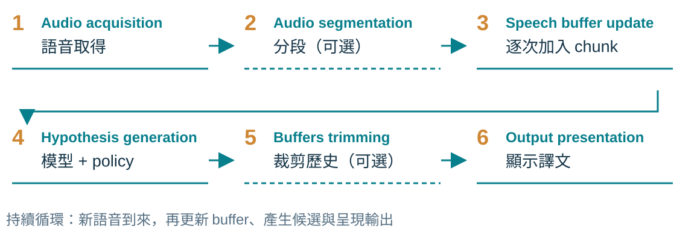
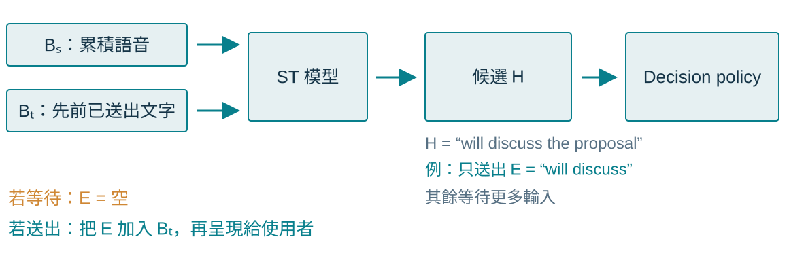
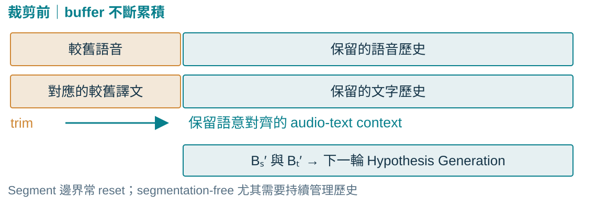
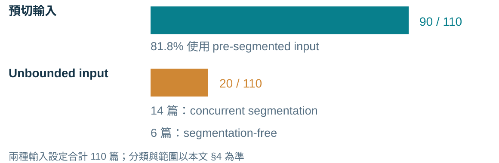
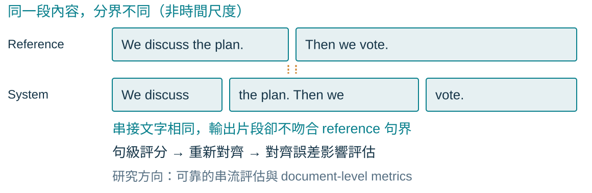

## 這篇論文在問什麼？

::: {.lead}
在人工切好的句子上表現很好，<br>能否處理麥克風持續送來的語音？
:::

- **本文調查中多數研究的設定**：短音檔、已知邊界、每段可以重置。
- **真實場景**：持續輸入、自行選擇分段方式、持續管理歷史。
- **本文貢獻**：統一術語、拆解六步流程、分析 **110 篇**研究。

::: {.source}
來源：§1，pp. 281–282；§4，p. 288。本文統計描述其調查範圍，並非 2026 年的現況。
:::

::: {.notes}
**結論**：本文用術語、六步框架與 110 篇調查，檢查研究設定是否接近實際部署。

**例子**：一個模型能逐步翻譯人工切好的句子，不代表它已驗證完整的麥克風串流處理。

**易混淆處**：這是 survey 與概念框架，不是新翻譯模型。概念流程假設乾淨、單一語言、單一說話者與沒有重疊語音（§3.1）；雜訊、diarization、code-switching 不在此流程分析範圍。
:::

## Offline ST 與 SimulST

| | Offline ST | SimulST |
|---|---|---|
| 輸入方式 | 先取得完整語音段 | 隨語音到來逐步接收 |
| 輸出時機 | 完整段落之後翻譯 | 說話期間就產生部分譯文 |
| 主要取捨 | 翻譯品質 | 品質、延遲與輸出穩定性 |

::: {.takeaway .fragment}
SimulST 描述「邊聽邊翻」；是否夠快，仍須測量延遲。
:::

::: {.source}
來源：§1–2.1，pp. 281–282；§3.1–3.2，pp. 285–287。
:::

::: {.notes}
**結論**：SimulST 在接收語音的同時產生部分譯文；是否夠快還要測量延遲。

**例子**：同一個預切音檔，也可以模擬語音逐步到來，測試 simultaneous 翻譯。

**易混淆處**：Offline 可能先把長音檔分段；SimulST 也可能使用 bounded input。接收與輸出的時機，和是否預切，是不同問題。
:::

## 四個常見名稱，各自強調什麼？

| 名稱 | 本文的解讀 |
|---|---|
| **simultaneous** | 接收輸入與產生輸出同時進行 |
| **real-time** | 處理與回應的延遲低 |
| **streaming** | 在相關 ASR 文獻中強調逐步處理語音 |
| **online** | 常被用來與 offline 對比 |

::: {.takeaway}
名稱不足以判定系統能力：還要看輸入、邊界與延遲設定。
:::

::: {.source}
來源：Table 1，p. 286；§4 “The Terminological Chaos”，pp. 287–288。
:::

::: {.notes}
**結論**：名稱不足以判斷系統能力，必須檢查輸入假設與延遲。

**例子**：標題寫 streaming，實驗仍可能使用 gold pre-segmented input。

**易混淆處**：Table 1 明確定義 simultaneous、real-time；streaming、online 此處整理的是 §4 文獻用法，不是普遍定義。作者調查中超過 65% 混用名稱，並非現今所有研究的比例。
:::

## Bounded input 從哪裡來？

{.diagram}

::: {.takeaway}
Bounded／unbounded 看輸入假設，不能只看音訊長短。<br>系統切出 bounded segments，仍可能是在處理 unbounded input。
:::

::: {.source}
依 §3.1–3.2，pp. 284–286 重繪。unbounded 指事前沒有整體長度資訊，並非真的無限長。
:::

::: {.notes}
**結論**：先區分系統拿到的輸入，與系統內部切出的 segments。

**例子**：麥克風 stream 經線上 segmentation 成為 S1、S2；另一條路則在翻譯前就備妥預切音檔。

**易混淆處**：Unbounded 指沒有明確的整體長度資訊，並非真的無限長。本文 bounded setting 以預切音訊為主。Gold 是人手動切分或修正；automatic pre-segmentation 是在翻譯前自動切分。從 stream 切出 bounded segments，不會把整個系統的 unbounded input 假設改成 pre-segmented setting。Segmentation-free 可直接處理 stream。
:::

## Segment 和 chunk 差在哪？

{.diagram}

::: {.takeaway}
Segment 是有邊界的處理單位；chunk 是逐次餵入的單位。<br>同樣的 500 ms chunks，可來自預切音檔或 continuous stream。
:::

::: {.source}
依 §3.1，p. 284；Table 1，p. 286 重繪。500 ms 為原文舉例，不是固定規定。
:::

::: {.notes}
**結論**：Segment 是有邊界的處理單位；chunk 是 incremental feeding unit。

**例子**：3 秒 segment 可以分成 6 個 500 ms chunks；同樣 500 ms chunks 也可持續來自 unbounded stream。

**易混淆處**：Chunk size 不能定義 input setting。500 ms、3 秒都是示例。Chunk 不需完整語意；segment 也不保證是完整句子。Segmentation-free 仍然能接收 chunks。
:::

## Direct 到底省略了什麼？

{.diagram}

::: {.takeaway}
Direct 省略明確的中間 ASR 輸出，仍可使用目標語文字歷史。<br>Direct／cascade 與是否需要 segmentation，是不同選擇。
:::

::: {.source}
依 §2.1，p. 282；§3.2，pp. 286–287 重繪。
:::

::: {.notes}
**結論**：Direct 省略明確產生的中間 ASR 輸出，而不是省略所有文字資訊。

**例子**：Direct ST 可以讀取先前已送出的目標語文字，作為下一輪 context。

**易混淆處**：ASR 是語音辨識，MT 是文字翻譯，ST 是語音翻譯。Direct 可有 ASR pre-training、CTC 或 multi-task supervision，也可搭配 segmentation。Cascade 的 ASR 錯誤可能傳到 MT。
:::

## 讀一個系統，要分開看三個維度

| 維度 | 要問的問題 | 常見選擇 |
|---|---|---|
| **輸入設定** | 翻譯開始前，音訊是否已預切？ | Bounded／Unbounded |
| **模型架構** | 是否經過明確的中間 ASR 輸出？ | Cascade／Direct |
| **輸出策略** | 已顯示的譯文是否允許修訂？ | Incremental／Re-translation |

::: {.takeaway}
「Direct + bounded input + incremental output」是三項描述。<br>只知道 direct，還不足以判斷系統如何處理串流。
:::

::: {.source}
來源：§3.2，Figure 2，pp. 285–287；組合為教學示例。輸出策略稍後由 Step 6 展開。
:::

::: {.notes}
**結論**：輸入、模型架構與輸出策略要分開描述。

**例子**：一個系統可以是 direct、使用 bounded input，並採用只追加的 incremental output。

**名稱用法比較**：StreamAtt 2024 把 SimulST 描述為處理預切語音，以 continuous、unbounded streams 定義 StreamST；TACL 2025 則以較廣的 SimulST 框架整理輸入假設。這是兩篇論文的用語範圍差異，不是全領域固定二分法。[StreamAtt 原文](https://aclanthology.org/2024.acl-long.202/) · [共用術語筆記](../notes/terminology.html)

**易混淆處**：知道其中一項，不能直接推出另外兩項。Re-translation 在這裡是允許修訂已顯示文字的策略，將在 Step 6 具體示範。這張表整理的是本文 taxonomy，不是規定所有組合都有相同效果。
:::

## SimulST 的六步流程

{.diagram}

::: {.source}
依 §3.1，Figure 1，pp. 284–285 重繪。Step 2 與 Step 5 可選；實作不一定分成六個獨立模組。
:::

::: {.notes}
**結論**：六步框架用來定位一個系統負責哪些工作。

**例子**：預切音檔研究通常把重點放在 hypothesis generation；完整 stream 系統還要處理邊界與歷史。

**易混淆處**：依次為 Audio Acquisition、Audio Segmentation、Speech Buffer Update、Hypothesis Generation、Speech and Text Buffers Trimming、Output Presentation。Step 2、5 是可選概念步驟，實作不一定有六個獨立模組。Step 4 包含模型與 policy。
:::

## Step 1–3：chunk 如何累積到 buffer？

```{=html}
<div class="buffer-demo" data-demo="buffer">
  <div class="demo-heading">新 chunk → Speech Buffer B<sub>S</sub> → 模型可用的語音歷史</div>
  <div class="chunk-track" aria-label="音訊 chunks">C₁ · C₂ · C₃ · C₄ · C₅ · C₆</div>
  <div class="buffer-row"><strong>B<sub>S</sub></strong><div class="buffer-content" aria-live="polite">尚未收到 chunk</div></div>
  <div class="buffer-row"><strong>B<sub>T</sub></strong><div>先前已送出的譯文；本頁只示範 Step 3，不更新文字</div></div>
  <div class="demo-controls"><button type="button" data-action="next">接收下一個 chunk</button><button type="button" data-action="reset">重置示例</button><span class="demo-status">t = 0</span></div>
</div>
```

::: {.takeaway}
B<sub>S</sub><sup>t</sup> ← B<sub>S</sub><sup>t−1</sup> ⊕ C<sub>t</sub>　（⊕ 表示接續）
:::

::: {.source}
來源：§3.1，Step 3–4，p. 284。互動示例僅演示累積，沒有執行語音翻譯模型。
:::

::: {.notes}
**結論**：Chunk 是新輸入，buffer 是當前保留的歷史容器。

**例子**：按兩次按鈕，B_S 累積 C1、C2；本頁不執行翻譯，也不更新 B_T。

**易混淆處**：B_T 是先前已送出的目標語文字歷史，不是中間 ASR transcript。模型可以讀全部或部分 speech buffer。t 表示更新序號，示例時間由每塊 500 ms 換算，不是模型運算耗時。
:::

## Step 4：hypothesis 不等於 emitted output

{.diagram}

::: {.takeaway}
H 是模型候選譯文；E 是 policy 決定這次送出的部分。<br>等待更多輸入，通常帶來更多上下文，也增加延遲。
:::

::: {.source}
依 §3.1，Step 4，pp. 284–285 重繪。候選文字與選取規則均為教學示例。
:::

::: {.notes}
**結論**：H 是模型候選；E 是 policy 選擇這次送出的內容。

**例子**：H 為 will discuss the proposal；policy 先送出 will discuss，或選擇等待使 E 為空。

**易混淆處**：概念式為 H ← M(B_S^t, B_T^(t−1))；E = policy(H)；B_T^t ← B_T^(t−1) ⊕ E。示例不是特定 wait-k、local agreement 或 StreamAtt 演算法。永久 commit 要限定只追加策略；re-translation 能修訂已顯示文字。
:::

## Policy 已決定輸出，為何還要 trimming？

{.diagram}

::: {.takeaway}
Step 4 決定現在送出什麼；Step 5 決定下一輪保留什麼。<br>有 segment 邊界時通常 reset，可省去額外的部分裁剪。
:::

::: {.source}
依 §3.1，Step 5，p. 285 重繪。圖中刪除量為示意，非本文指定的 trimming 演算法。
:::

::: {.notes}
**結論**：Step 4 管現在的輸出決策；Step 5 管下一輪的上下文。

**例子**：已送出一段譯文後，可裁掉對應的較舊語音與文字；有 segment 邊界時，通常直接 reset。

**易混淆處**：部分 trimming 保留部分歷史；reset 完全清空，可視為完全 trimming 的特例。Step 5 optional 不代表長串流可以無限制累積：若邊界已提供重置機制，可不需額外部分裁剪。歷史管理須注意語音與文字的語意對齊，不能把 chunk 與 token 當成固定一對一關係。裁掉 buffer 不等於刪除已顯示字幕；修訂顯示屬於 Step 6。
:::

## Step 6：incremental 與 re-translation

```{=html}
<div class="output-demo">
  <div class="output-line"><h3>Incremental</h3><p>We <span class="fragment" data-fragment-index="0">will discuss </span><span class="fragment" data-fragment-index="1">the proposal.</span></p><small>只追加新的 tokens，已送出的錯誤無法回改</small></div>
  <div class="output-line"><h3>Re-translation</h3><p><span class="fragment fade-out" data-fragment-index="2">We discuss the plan.</span><span class="fragment fade-in" data-fragment-index="2">We will discuss the proposal.</span></p><small>可修改已顯示文字，須考慮 flickering 與重讀負擔</small></div>
</div>
```

::: {.takeaway}
逐步接收輸入，和是否改寫已顯示輸出，是不同問題。
:::

::: {.source}
來源：§3.2，p. 287；§5，pp. 290–291。英文句子為教學示例。
:::

::: {.notes}
**結論**：兩種策略的差別是能否修改已顯示文字。

**例子**：方向鍵先追加 incremental tokens，再把 We discuss the plan 修訂為 We will discuss the proposal。

**易混淆處**：本文的一般 incremental 定義是逐步發生；作為 output strategy 時，特指只追加且不能修訂。Re-translation 有機會提高最終品質，但 flickering 帶來重讀負擔。要一起評估品質、延遲與穩定性。
:::

## 調查中的輸入設定：110 篇研究

{.diagram}

::: {.takeaway}
大多數研究沒有直接面對 unbounded input 的完整挑戰。
:::

::: {.source}
來源：§4 “Humans Will Not Segment Our Audio”，p. 288；Appendix A。分類數據為本文調查結果。
:::

::: {.notes}
**結論**：本文調查中，大多數研究使用預切輸入。

**例子**：90/110=81.8% 為 pre-segmented；20 篇 unbounded，其中 14 篇 concurrent segmentation、6 篇 segmentation-free。

**易混淆處**：97.7% 的 gold segmentation 比例以 pre-segmented 子集為分母。架構數為 64 direct、49 cascade，不是互斥 partition；93 incremental 也不能由 110−93 推出全部 re-translation 數量。這是本文調查範圍，不是 2026 年研究普查。
:::

## Gold segmentation 藏起了哪些問題？

Gold segmentation：翻譯前由人手動切分或修正的語音邊界。

| 被預先處理的部分 | 真實系統仍須解決 |
|---|---|
| 句子邊界 | 用 VAD、語意訊號或模型來判定邊界 |
| 音檔結束點 | 決定何時停止等待、何時 reset |
| 短段落的上下文 | 管理長串流的語音與文字歷史 |

::: {.takeaway}
Automatic pre-segmentation 是改善實驗條件的一步；<br>它仍不同於在 live stream 中即時分段。
:::

::: {.source}
來源：§2.2，pp. 282–283；§4–5，pp. 288–289。
:::

::: {.notes}
**結論**：Gold segmentation 預先解決部分邊界問題，削弱了完整串流挑戰。

**例子**：人工先按句子切好的音檔，讓系統知道每段結束點；live stream 要自行管理上下文與結束決策。

**易混淆處**：VAD 偵測語音活動與停頓，不保證語意句界。作者建議 bounded 實驗至少用 automatic pre-segmentation；這仍不同於 concurrent segmentation。Segmentation-free 可用歷史管理持續處理輸入，不必產生句子 segments。本文是研究建議，不是證明某套部署架構最佳。
:::

## 延遲：有沒有算運算時間？

| 觀點 | 要回答的問題 |
|---|---|
| **Computationally unaware** | 假設模型運算時間為零，來源資訊到對應譯文的延遲 |
| **Computationally aware** | 計入實際運算時間，來源資訊到對應譯文的延遲 |

兩者都看輸出時機；unaware 也反映 policy 決策與跨語言字序。

::: {.takeaway}
作者建議固定報告 unaware；可行時加報 aware，<br>aware 應在相同硬體與執行環境下比較。
:::

::: {.source}
來源：§3.2，p. 287；§5，pp. 289–291。評估限制指本文發表時討論的工具與設定。
:::

::: {.notes}
**結論**：兩種延遲都衡量來源資訊到對應譯文的延遲，差別在是否計入運算時間。

**例子**：同一策略在較慢硬體上，aware latency 可能較高；unaware 依零運算時間假設計算。

**易混淆處**：Unaware 也反映 policy 決策時機與跨語言字序，不能簡化成單一等待時間。Aware 受硬體、程式與 scheduling 影響。作者建議固定報告 unaware，可行時加報 aware，且 aware 比較使用相同環境。不要把兩者差異當作任何排程下都能直接相加的公式；本文未給普遍可接受的延遲門檻。
:::

## 長串流為何難以評估？

{.diagram}

::: {.takeaway}
連續輸出不一定吻合 reference 句界；句級評分需要重新對齊。<br>對齊出錯，可能影響品質與延遲評估的可靠性。
:::

::: {.source}
依 §5 “Create an Evaluation Framework for Unbounded Speech”，pp. 289–290 重繪。文字與分界為教學示例。
:::

::: {.notes}
**結論**：System output 與 reference 的分界不同，句級評估需要可靠對齊。

**例子**：參考譯文切成兩句，系統逐步產生三個片段；即使串起來文字相同，也不能把片段直接一對一評分。

**易混淆處**：圖不是時間軸，也不是詞與語音的真實對齊。原文討論句級評分需要 mWERSegmenter 等重對齊工具，對齊錯誤影響可靠性。作者建議改善 unbounded 評估並納入 document-level metrics。StreamLAAL 是引用 Papi et al. (2024b) 的既有延伸，不是本篇新提出，也不是單純把計算時間加到 LAAL。工具限制以本文發表時的討論為準。
:::

## 設計 SimulST 時，先說清楚這些選擇

1. **輸入**：gold／automatic pre-segmented，還是 unbounded？
2. **流程**：誰分段？誰選擇 E？如何 trim／reset？
3. **架構與輸出**：direct／cascade；追加／允許修訂？
4. **評估**：品質、延遲、長串流與人的理解是否一起驗證？

::: {.closing}
把假設說清楚，才能知道方法改善了哪一部分。
:::

::: {.source}
Papi, S., Polák, P., Macháček, D., & Bojar, O. (2025). *How “Real” is Your Real-Time Simultaneous Speech-to-Text Translation System?* TACL 13: 281–313. [論文與資料](https://aclanthology.org/2025.tacl-1.14/) · [PDF](https://aclanthology.org/2025.tacl-1.14.pdf)
:::

::: {.notes}
**結論**：描述系統時，要一起交代輸入、流程、架構與輸出，以及評估。

**例子**：閱讀下一篇 paper，先問輸入是否 gold pre-segmented，再找 policy、trim/reset 與延遲設定。

**易混淆處**：這些是作者的研究建議，不是已驗證的新最佳模型。自己的實作或研究構想要清楚標示。評估還應包含字幕呈現、修訂與人的理解；本文以 CC BY 4.0 發布，本簡報為中文導讀與重新繪製的教學圖解。
:::
