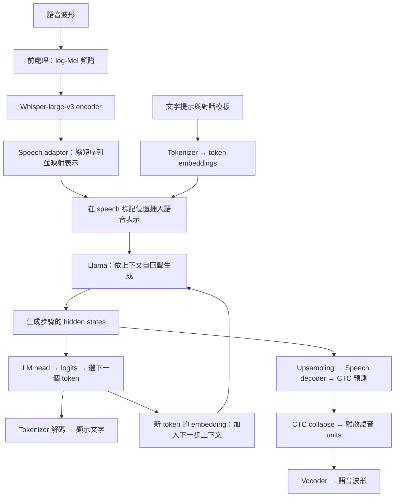

# LLaMA-Omni：架構理解與初步任務測試
整理日期：2026-10-08

> 這是初學者實作進度報告，不是已完成的論文導讀。研究者目前主要透過實作、AI 討論及網路資料建立理解，尚未自行通讀論文。本頁由 AI 協助整理，架構對照官方論文與程式；實驗結果依研究者貼出的輸出重建，沒有重新執行或直接核驗伺服器原始檔案。

## 給老師的進度摘要

- 已完成環境與模型準備，跑通英文語音輸入 → 文字回答 → 語音回答；研究者已聆聽一次輸出並回報正常。
- 以三個內容、四種條件做初步探索，共記錄 12 個文字輸出；另保留一次修改 system prompt 的結果。
- 觀察到輸出隨樣本和條件不同：有時回答問題、有時轉寫，也有中文翻譯或不準確中文輸出。
- 現在只能描述這份權重在已測條件下的行為，不能據此定位 adaptor 的問題，也不能證明架構無法做語音翻譯。
- 本輪沒有微調、串流輸入、延遲測量或正式翻譯評分。

## 1. 手繪圖的理解與修正

你的主要路徑是正確的：

上圖是資料流概念圖，不是每行程式的執行時間圖。

| 手繪圖的位置 | 建議寫法與原因 |
| --- | --- |
| Mel → Whisper encoder | 正確。此路徑使用 encoder 提取特徵，不先透過 Whisper decoder 產生輸入逐字稿。 |
| Adaptor | 正確。相鄰幀合併以縮短序列，再映射到 LLM 接受的維度；輸出仍是連續向量，不是中文字或英文字。 |
| 「文字向量 + 語音向量」 | 改成「組成同一個輸入序列」。語音表示插入提示中的對應位置，不是把兩個向量逐元素相加。 |
| Llama → hidden states | 正確。hidden states 是依上下文計算出的內部表示，不宜直接稱為「輸出語音特徵」。 |
| LM head → 下一個字 | 改成「下一個 token 的 logits／機率 → 選取 token」。一個 token 不一定是一個中文字或英文單字。 |
| 生成 token 與 hidden states 的關係 | 當步 hidden state 用來預測下一個 token；選出的 token 在後續步驟經 embedding 回到 LLM。不要畫成當步 token 先產生當步預測它自己的 hidden state。 |
| Hidden states → Speech decoder | 箭頭朝 decoder；再經 CTC 得到離散 units，最後由 vocoder 合成波形。decoder 不會回頭產生 Llama 的 hidden states。 |

文字與語音支線的訓練目標是表達同一個回答，但不能保證每次逐字一致。units 是離散代碼，不是能直接播放的聲音。CTC collapse 會合併相鄰重複標籤並移除 blank；blank 分隔的重複標籤不應一概刪掉。

程式對照：[輸入表示組合](https://github.com/ictnlp/LLaMA-Omni/blob/main/omni_speech/model/omni_speech_arch.py)、[語音輸出模型](https://github.com/ictnlp/LLaMA-Omni/blob/main/omni_speech/model/language_model/omni_speech2s_llama.py)、[官方專案](https://github.com/ictnlp/LLaMA-Omni)。

## 2. 名詞與目前的實作範圍

| 任務 | 目標 |
| --- | --- |
| 語音問答／指令回應 | 聽到問題後給答案；目前主要跑通的功能。 |
| ASR／轉寫 | 寫出錄音原話，不回答問題。 |
| Speech Translation（ST） | 翻譯錄音原話，保留問句、資訊與語意。 |
| 純文字翻譯對照 | 用同份模型直接輸入文字，跳過語音 encoder 與 adaptor。 |
| TTS | 將指定文字唸出來。文字提問後生成另一段回答及語音，不等於已驗證任意文字 TTS。 |
| Streaming ST | 需研究音訊持續輸入時的增量翻譯及延遲。本輪未測。 |

官方模型的 streaming speech decoder 涉及輸出語音的增量生成；不能直接等同於模型已具備串流輸入的語音翻譯能力。

## 3. 實驗方法與資料完整性

模型：本地載入的 Llama-3.1-8B-Omni。沒有修改權重或訓練。主要比較推論時的輸入形式與任務提示。

| 條件 | 輸入 | 任務意圖 |
| --- | --- | --- |
| C1 | 語音 | 回應提供的內容 |
| C2 | 語音 | 英文逐字轉寫 |
| C3 | 語音 | 翻成繁體中文 |
| C4 | 人工文字 | 以文字替代 C3 的語音標記，要求翻譯 |

**這是依對話重建的條件摘要，不能取代原始 question.json。** 完整 system/user prompt、各次執行指令、最後使用的腳本與輸出檔仍待從伺服器回收。缺漏欄位保持待核對，不補寫成實測事實。

已貼出的 C4 程式使用同一模型類別、s2s=True，不傳入 speech；do_sample=False、num_beams=1、max_new_tokens=256、use_cache=True、pad_token_id=128004、streaming_unit_gen=False。這些是「貼出的腳本設定」，尚未逐筆核驗所有執行。腳本曾有重新建立 conv 而覆蓋自訂 system 的風險，完整 prompt.txt 應納入後續核對。安裝 FlashAttention 不等於每次推論都有啟用它。

| 樣本 | 錄音與參考內容 |
| --- | --- |
| A01 | runs/retest_st/audio/A01cool_music.wav；使用者提供：what are some cool music from the one thousand nine hundred and twenties。C4 額外補問號。 |
| A02 | runs/retest_st/audio/A02meeting.wav；The meeting has been moved from Monday morning to Tuesday afternoon. |
| A03 | 後來改為蘋果、香蕉、不烹煮點心的情境題。最終檔名及精確原話待核對；不能拿模型 C4 輸出充當人工逐字稿。 |

較早的 A03USA_name.wav 與前期摸索不列入本輪 12 格結果。最初官方範例只作環境／端到端流程驗證。

## 4. 本輪原樣輸出與人工初判

以下完整保留使用者貼出的 prediction；不是重新執行的結果。評語屬人工初步判讀，未做盲評或自動評分。

| 測試 | 模型輸出（原樣） | 初步判讀 |
| --- | --- | --- |
| A01-C1 | Some cool music from the one thousand nine hundred and twenties includes jazz legends like Louis Armstrong and Duke Ellington, as well as popular songs from the Roaring Twenties like 'The Charleston' and 'Five Foot Two, Eyes of Blue'. | 英文回答問題；內容事實未另查核 |
| A01-C2 | Some cool music from the one thousand nine hundred and twenties includes jazz legends like Louis Armstrong and Duke Ellington, as well as popular songs like 'The Charleston' and 'Five Foot Two, Eyes of Blue'. | 回答問題，未逐字轉寫 |
| A01-C3 | Some cool music from the one thousand nine hundred and twenties includes jazz legends like Louis Armstrong and Duke Ellington, as well as popular songs like 'The Charleston' and 'Five Foot Two, Eyes of Blue'. | 英文回答，未翻譯 |
| A01-C4 | What are some cool music from the one thousand nine hundred and twenties? | 保留英文問題，未翻譯 |
| A02-C1 | The meeting has been rescheduled to Tuesday afternoon. | 英文改述；省略原時段 |
| A02-C2 | The meeting has been moved from Monday morning to Tuesday afternoon. | 與提供的原話一致 |
| A02-C3 | 会议已从星期一上午到星期二下半天进行。 | 嘗試中文輸出，但改期語意不準確且非繁體 |
| A02-C4 | 會議已從星期一上午改到星期二下午。 | 人工初判符合繁體中文翻譯 |
| A03-C1 | You can make a fruit salad with your apples and bananas, or try making a smoothie by blending them together with some yogurt or milk. | 英文回答點心建議 |
| A03-C2 | You can make a fruit salad or a smoothie with your apples and bananas without cooking. | 仍回答問題；是否逐字一致須原音檔核對 |
| A03-C3 | You can make a fruit salad or a smoothie with your apples and bananas without cooking. | 英文回答，未翻譯 |
| A03-C4 | What kind of snack can you make with apples and bananas at home without cooking? | 輸出英文問題，未翻譯 |

### 額外對照：A01-C4-system

自訂 system 的意圖是忠實翻譯、保留問句、不回答錄音中的問題。使用者回報：

> 一九二零年代的cool音乐包括Jazz、Blues和Swing音乐。

它雖包含中文，仍在列舉音樂類型，沒有把原本的疑問句忠實翻成繁體中文。因此不能算翻譯成功。此條件另列，不混入主要 12 格。

## 5. 能說與不能說的結論

**可以說：** 本輪 A01/A03 的多個語音條件仍產生回答；A02-C2 與提供的英文原話一致，A02-C3 嘗試中文但語意與字體有問題，A02-C4 得到合理的繁體翻譯。文字輸入對照也不是每筆都翻譯成功。

**不能說：**

- 不能認定語音 adaptor 一定是問題來源；尚未拆開語音表示、提示、LLM 任務遵循及其互動。
- 不能說 LLM 本身「沒有問題」，也不能說模型「不論 prompt 如何都只回答」。
- 不能把不同內容間的差異歸因為問句或陳述句；長度、詞彙、錄音條件等同時不同。
- 不能把中文輸出當成翻譯成功；還需評估語意忠實、遺漏／新增、繁體字與問句保留。
- 不能用三筆便利樣本推估一般成功率，或推論微調後仍不可能完成 ST。

論文的設計重點是語音指令互動；訓練分兩階段，先訓練 adaptor 與 LLM，再訓練 speech decoder，speech encoder 保持凍結。這可提供「訓練任務可能影響行為」的假設，卻不是本輪失敗原因的實驗證明。原論文沒有直接解釋我們這些錄音的翻譯結果。參見 [v1 §2.5、§3、§4.2](https://arxiv.org/html/2409.06666v1)。

## 6. 已完成的環境與流程檢查

依使用者提供的終端輸出：Linux x86_64、RTX 3090（24 GiB）、Python 3.10.22、PyTorch 2.1.2+cu121、nvcc 12.1、GCC/G++ 11.4、FlashAttention 2.5.8。GPU 計算與數值比對通過；pip check 顯示 No broken requirements found。fairseq vocoder 匯入成功；Whisper CPU 載入成功，Mel 頻帶數 128、特徵維度 1280。

曾生成 16 kHz、16.44 秒的回答音檔，研究者聆聽回報正常。這是流程驗證，不是翻譯品質或語音品質的量化結果。OmegaConf 的舊版依賴格式仍出現警告，pip check 通過不代表已消除所有相容性風險。

## 7. 接下來先補齊理解與紀錄

1. 自行讀 v1 §2 與 Figure 2，把每個箭頭對到程式。
2. 回收 12 次測試的 question.json、prompt.txt、answer.json、執行腳本與命令，確認 C1–C4 的差異。
3. 補 A03 精確原話、最終檔名、各音檔長度／取樣率／SHA-256、模型與程式 revision；音訊與權重不放進 Git。
4. 在這些紀錄齊全後再決定是否擴充控制實驗。先不宣稱已完成 streaming ST 或開始微調。

## 參考與附檔

- [LLaMA-Omni 論文 v1](https://arxiv.org/pdf/2409.06666v1)：架構與訓練設計依據，研究者尚待自行閱讀。
- [官方程式與使用方式](https://github.com/ictnlp/LLaMA-Omni)。
- [模型設定](https://huggingface.co/ICTNLP/Llama-3.1-8B-Omni/blob/main/config.json)。
- [結構化實驗紀錄](results.json)：依對話重建，非原始推論日誌。
- [網頁閱讀版](../../docs/SpeechLLM/index.html)。

官方程式連結指向 main，未固定為實驗當時的 commit；後續應補上版本以利重現。
