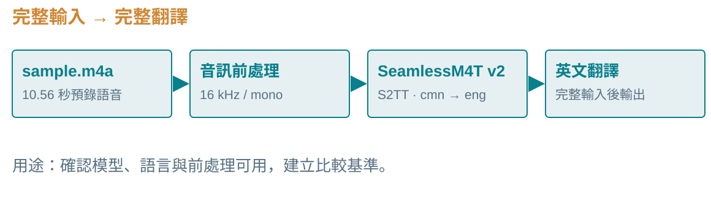
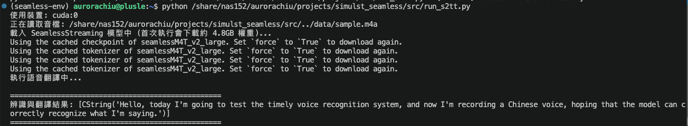
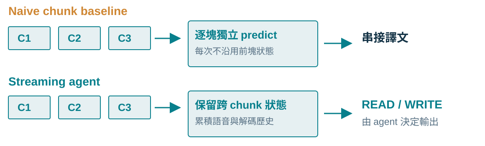
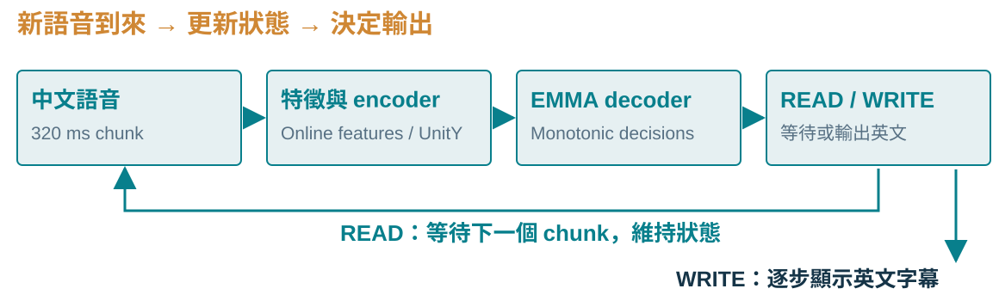
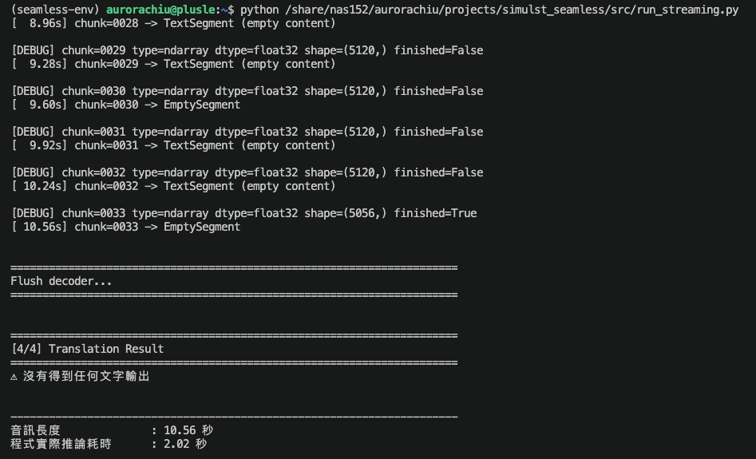
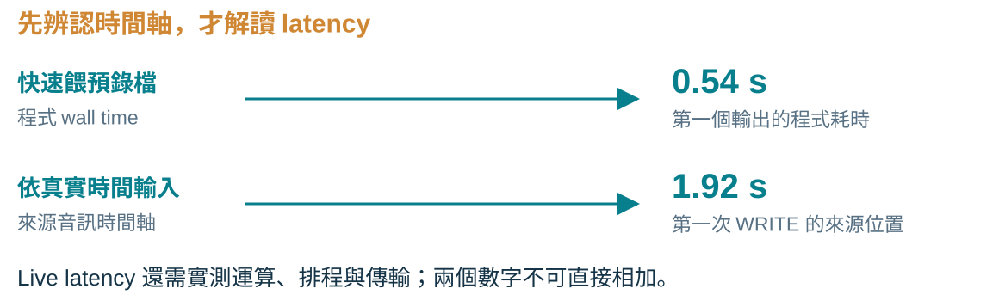
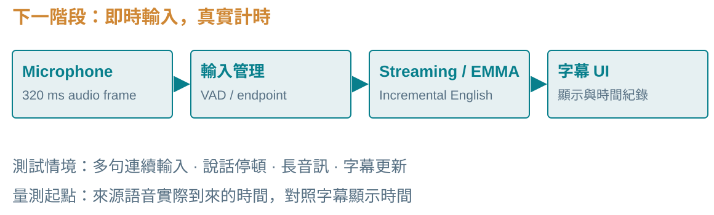
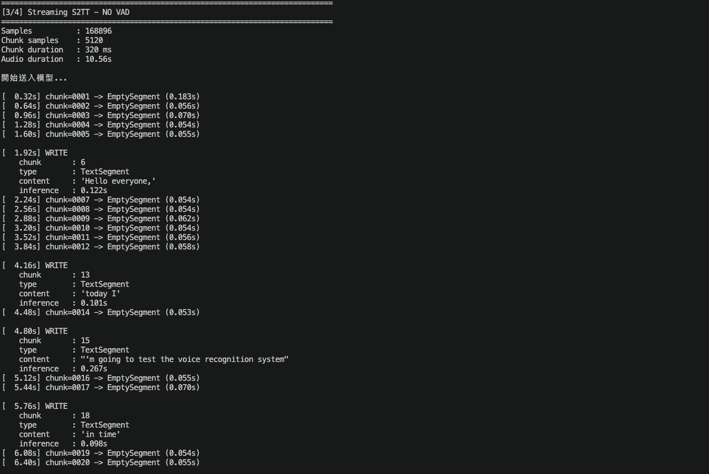
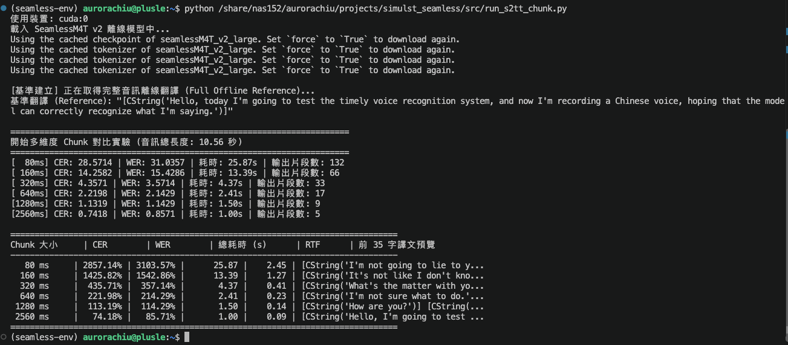
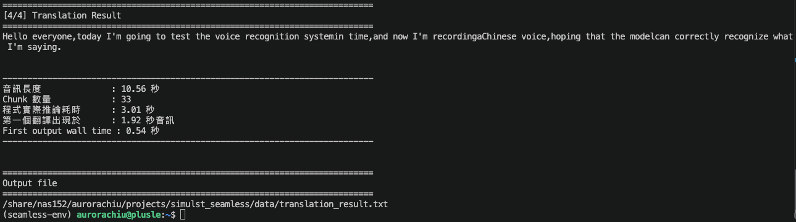

## 這週做到哪裡？

::: {.lead}
同一段中文語音，<br>從完整翻譯走到逐步 WRITE。
:::

- **Offline baseline**：整段音訊一次送入 SeamlessM4T v2。
- **Naive chunk baseline**：每個 chunk 獨立翻譯，再串接結果。
- **SeamlessStreaming / EMMA**：保留跨 chunk 狀態，已成功輸出英文。

::: {.source}
本次實驗：10.56 秒預錄音訊，cmn → eng，S2TT。數據為單一樣本的初步結果。
:::

::: {.notes}
**結論**：三個版本已跑通，目前最重要的進展是 streaming agent 能逐步產生文字。

**例子**：三個版本使用同一段 10.56 秒中文語音，可以比較完整輸入、獨立分塊與跨塊保留狀態的行為。

**易混淆處**：這仍是預錄音檔模擬串流，尚未驗證麥克風即時輸入。不能把單一樣本結果推廣到所有音訊。
:::

## SeamlessM4T v2 與 SeamlessStreaming

::: {.compact-table}
| 項目 | SeamlessM4T v2 | SeamlessStreaming |
|---|---|---|
| 本次使用方式 | 等完整輸入後翻譯 | 邊聽邊決定是否輸出 |
| 本次程式 | `Translator(...)` | `SeamlessStreamingS2TDetokAgent(...)` |
| Decoder | 一般離線 decoder | Monotonic decoder |
| 核心機制 | Offline seq2seq | **EMMA** |
| 關注重點 | 翻譯品質 | **品質與延遲的取捨** |
:::

::: {.takeaway}
EMMA = Efficient Monotonic Multihead Attention。<br>本次 streaming 版本透過單調式決策，逐步產生翻譯。
:::

::: {.source}
依原簡報的模型與程式設定整理；模型與官方程式來源見末頁。
:::

::: {.notes}
**結論**：這次改用具有 streaming / monotonic decision mechanism 的 decoder。

**例子**：Streaming agent 在接收更多來源語音後，決定 READ 或 WRITE。

**易混淆處**：把 offline model 放進切 chunk 的 for-loop，不會因此獲得相同的跨塊狀態與決策機制。表格描述本次實作的使用方式。
:::

## 實驗 1：先建立 Offline baseline

{.diagram fig-alt="預錄音訊先轉成 16 kHz 單聲道，再由 SeamlessM4T v2 產生完整英文翻譯。"}

::: {.takeaway}
先確認模型、語言設定與音訊前處理能正常工作，<br>再把完整翻譯當作後續的比較基準。
:::

::: {.source}
本次設定：sample.m4a → 16 kHz / mono → SeamlessM4T_v2_large → S2TT（cmn → eng）。
:::

::: {.notes}
**結論**：Offline baseline 是這次實作的起點。

**例子**：先把 m4a 轉成模型可用的 16 kHz 單聲道音訊，再取得完整英文輸出。

**易混淆處**：模型輸出的英文可用於初步比較，但不是人工 ground truth。核心 predict 呼叫留在附錄。
:::

## Offline baseline：完整輸入可以成功翻譯

{.evidence .evidence-wide fig-alt="原始 offline baseline 執行結果截圖。"}

::: {.takeaway}
整段輸入能產生完整英文翻譯；接著檢查分塊處理會如何改變輸出。
:::

::: {.source}
原始實驗截圖：images/offline_result.png。語意合理性為本次人工觀察，尚非正式品質評分。
:::

::: {.notes}
**結論**：目前的模型、音訊格式與語言設定至少能完成這個 offline 樣本。

**例子**：截圖保留完整音訊的英文翻譯，供後續分塊輸出比較。

**易混淆處**：Offline 成功不能排除所有 streaming 問題，也不能代表已達 real-time translation。
:::

## 實驗 2：每個 chunk 都獨立翻譯

{.diagram fig-alt="Naive chunk 每塊獨立呼叫 offline 模型；streaming agent 則維持跨 chunk 狀態並決定 READ 或 WRITE。"}

::: {.takeaway}
測試 80／160／320／640／1280／2560 ms；<br>Naive baseline 每塊重新呼叫模型，最後串接譯文。
:::

::: {.source}
本次 naive chunk 設計：相同 10.56 秒音訊；與完整 offline 輸出比較 CER / WER。
:::

::: {.notes}
**結論**：這個 baseline 用來觀察獨立分塊呼叫的限制。

**例子**：320 ms 的一塊音訊獨立翻譯後，下一塊又從新輸入開始；沒有沿用前一塊的翻譯狀態。

**易混淆處**：此實驗與 streaming agent 的差異不只在 chunk size，也包括模型與狀態管理，因此不能把結果解讀為單一變因的對照。
:::

## Naive chunking：越小並不一定越快

::: {.compact-table}
| Chunk | CER | WER | 推論時間 | RTF |
|---:|---:|---:|---:|---:|
| 80 ms | 2857.14% | 3103.57% | 25.87 s | 2.45 |
| 160 ms | 1425.82% | 1542.86% | 13.39 s | 1.27 |
| 320 ms | 435.71% | 357.14% | 4.37 s | 0.41 |
| 640 ms | 221.98% | 214.29% | 2.41 s | 0.23 |
| 1280 ms | 113.19% | 114.29% | 1.50 s | 0.14 |
| 2560 ms | 74.18% | 85.71% | 1.00 s | 0.09 |
:::

::: {.takeaway}
本次 80／160 ms 的 RTF > 1；短片段的輸出也偏離完整翻譯。
:::

::: {.source}
原簡報實驗數據，未重新執行。CER / WER 的比較對象是 offline 模型輸出，並非人工 reference。
:::

::: {.notes}
**結論**：這個樣本中，縮小 chunk 沒有改善整體計算速度或輸出一致性。

**例子**：80 ms 共耗時 25.87 秒，超過 10.56 秒音訊長度；2560 ms 耗時 1.00 秒。

**易混淆處**：此處 CER / WER 衡量與 offline 輸出的差異，不是正式翻譯品質。數值可超過 100%，因為大量 insertion 會使編輯距離大於 reference 長度。
:::

## 怎麼解讀 chunk 實驗？

::: {.columns}
::: {.column width="50%"}
### 短片段的限制

- 每塊被當成獨立輸入。
- 不保留跨塊 encoder / decoder context。
- 重複呼叫帶來運算 overhead。
- 上下文太少，容易出現重複或失真。
:::
::: {.column width="50%"}
### 評估的限制

- **CER / WER 可超過 100%**：多餘字詞增加編輯距離。
- Offline 譯文只是比較基準。
- 後續需要**人工英文 reference**，再評估翻譯品質。
:::
:::

::: {.takeaway}
切小輸入不會自動得到好的串流翻譯；狀態與輸出策略也要一起設計。
:::

::: {.source}
本次實驗觀察與後續評估規劃；各項原因尚未透過獨立消融實驗驗證。
:::

::: {.notes}
**結論**：目前看到的是獨立分塊呼叫的限制，而非所有短 chunk 方法的限制。

**例子**：同一個詞跨越 chunk 邊界時，獨立推論缺少前後文；每塊重複呼叫也會增加 overhead。

**易混淆處**：原因是待驗證的解讀，不能把 overhead 全部歸因於重新載入模型。人工 reference 與 BLEU / chrF / COMET 留待後續實驗。
:::

## 實驗 3：改用官方 Streaming agent

::: {.columns}
::: {.column width="54%"}
### 載入與任務

```text
SeamlessStreamingS2TDetokAgent
           ↓
seamless_streaming_unity
           +
seamless_streaming_monotonic_decoder
           ↓
S2TT（cmn → eng）
```
:::
::: {.column width="46%"}
### 本次設定

::: {.compact-table}
| 設定 | 值 |
|---|---|
| Sample rate | 16 kHz |
| Chunk size | 320 ms |
| Decision threshold | 0.5 |
| VAD | Disabled |
| GPU / precision | RTX 3090 / fp16 |
:::
:::
:::

::: {.takeaway}
本次以 streaming unity + monotonic decoder，保留跨 chunk 狀態。
:::

::: {.notes}
**結論**：Streaming 版本已改用官方 agent 與對應模型。

**例子**：每次送入 320 ms 語音，再由 agent 決定是否產生 TextSegment。

**易混淆處**：VAD 在本次測試中關閉；目前設定不是所有情境的最佳參數。Import 路徑留在附錄。
:::

## Streaming pipeline：何時 READ，何時 WRITE？

{.diagram fig-alt="中文語音分為 320 ms chunk，經特徵與 encoder、EMMA decoder 後決定 READ 或 WRITE；READ 等待更多輸入，WRITE 輸出英文字幕。"}

::: {.takeaway}
Streaming agent 維持跨 chunk 狀態；<br>模型可以先讀取更多語音，再送出下一段英文。
:::

::: {.source}
依本次原簡報的 streaming pipeline 重繪，為概念流程，非逐層模型結構圖。
:::

::: {.notes}
**結論**：READ / WRITE 將逐步輸入與逐步輸出連接起來。

**例子**：不是每次收到 320 ms 就一定輸出；agent 可能繼續 READ，之後才 WRITE。

**易混淆處**：圖中循環代表持續接收語音，不代表 WRITE 後會重置模型。字幕後處理與 live microphone 還在下一階段。
:::

## 從沒有文字，到成功產生 TextSegment

::: {.columns}
::: {.column width="48%"}
{.evidence fig-alt="初期版本跑完 33 個 chunk 卻沒有輸出文字的紀錄。"}
:::
::: {.column width="52%"}
### 調整重點

- 使用正確的 detokenizing agent。
- `SpeechSegment` 指定 `tgt_lang="eng"`。
- Chunk 內容轉成 Python `list`。
- 最後一段設定 `finished=True`。
- 載入對應 streaming 模型組合。
:::
:::

::: {.takeaway}
調整後已產生 TextSegment；各項修正的獨立影響仍待驗證。
:::

::: {.source}
原始失敗紀錄：images/streaming_failed.png；調整項目依原簡報保留。
:::

::: {.notes}
**結論**：最初版本能跑完 33 個 chunk，卻沒有文字；目前已排除這個阻塞。

**例子**：最後一段的 finished=True 告知 agent 來源輸入結束。

**易混淆處**：這些是本次聯合調整的項目，沒有逐一消融，不能指定其中一項為唯一根因。
:::

## 成功輸出：先累積，再逐步 WRITE

::: {.output-table}
| 來源音訊位置 | 本次輸出的文字片段 |
|---:|---|
| 1.92 s | Hello everyone, |
| 4.16 s | today I |
| 4.80 s | I'm going to test the voice recognition system |
| 5.76 s | in time |
| 7.36 s | and now I'm recording |
| 8.00 s | Chinese voice |
| 10.24 s | hoping that the model |
| 10.56 s | can correctly recognize what I'm saying. |
:::

::: {.takeaway}
第一次 WRITE 發生在讀到 1.92 秒來源語音後；並非每個 chunk 都輸出。
:::

::: {.source}
原簡報的輸出片段與時間，文字原樣保留。時間是來源音訊位置，不是 live wall-clock。
:::

::: {.notes}
**結論**：這個樣本能在完整輸入結束前逐步輸出。

**例子**：1.92 秒先產生 Hello everyone，後面等待更多語音再輸出下一段。

**易混淆處**：表格保留實際輸出的不自然片段，如 today I 與 in time；尚未完成正式品質評估。來源位置不等於使用者看到字幕的真實時間。
:::

## 初步結果：計算速度有即時處理潛力

::: {.columns}
::: {.column width="42%"}
::: {.metric}
<p class="value">0.285</p>
<p class="label">Approx. compute RTF</p>
:::
::: {.metric}
<p class="value">1.92 s</p>
<p class="label">First WRITE 來源音訊位置</p>
:::
:::
::: {.column width="58%"}
::: {.compact-table}
| 指標 | 本次結果 |
|---|---:|
| Audio duration | 10.56 s |
| Chunk size / count | 320 ms / 33 |
| Total inference wall time | 3.01 s |
| First output wall time | 0.54 s |
:::
:::
:::

::: {.takeaway}
3.01 ÷ 10.56 ≈ 0.285；平均計算速度快於音訊時長，仍需驗證即時排程。
:::

::: {.source}
原簡報實驗數據，RTX 3090 / fp16；以預錄音檔快速餵入，未依 real-time pace 等待。
:::

::: {.notes}
**結論**：這個樣本的平均 compute RTF 小於 1，顯示計算速度有即時處理潛力。

**例子**：處理 10.56 秒語音耗時約 3.01 秒。

**易混淆處**：平均 RTF 不足以保證每個 chunk 的期限、長時間穩定性或端到端延遲。First output wall time 0.54 秒是快速餵資料條件下的測量。
:::

## 為什麼 0.54 秒不能直接當即時延遲？

{.diagram fig-alt="快速餵入測量得到 0.54 秒第一個輸出；真實串流必須等來源語音到來，模型在本例讀到 1.92 秒音訊後第一次 WRITE，還需考量運算與傳輸。"}

::: {.takeaway}
本例模型約讀到 1.92 秒語音後開始輸出；<br>真正的首字幕延遲，要在即時輸入下重新量測。
:::

::: {.source}
兩個數字來自不同時間軸：程式 wall time 與來源音訊位置；圖解不是新的測量結果。
:::

::: {.notes}
**結論**：目前不能把 0.54 秒報告為端到端 real-time latency。

**例子**：預錄檔可以比真實時間更快送完前 1.92 秒語音；麥克風必須等待說話者真的說到那裡。

**易混淆處**：Source waiting、計算、排程與傳輸可能部分重疊，不能把 1.92 與 0.54 直接相加當作測量值。下一步用 live microphone 或即時播放取得真實 wall-clock 紀錄。
:::

## 目前結論：已跑通，還需要正式評估

- **完整音訊 baseline 已成功**：模型與基本輸入設定可用。
- **獨立分塊的限制已看見**：本次小 chunk 品質差，且有較高 overhead。
- **SeamlessStreaming / EMMA 已跑通**：能在音訊結束前逐步 WRITE。
- **Compute RTF 約 0.285**：本例計算速度有即時處理潛力。
- **目前仍是預錄檔模擬**：品質與 live latency 尚待正式驗證。

::: {.closing}
接下來把「能輸出」推進到「能量測品質與真實延遲」。
:::

::: {.notes}
**結論**：實作已從 offline baseline 推進到能逐步輸出的 streaming agent。

**例子**：第一段文字在來源音訊 1.92 秒位置出現，完整音訊共有 33 個 chunk。

**易混淆處**：單一 10.56 秒音檔不足以證明長串流穩定性，也沒有正式證明 streaming 翻譯品質優於其他系統。
:::

## 下一步：品質與延遲分開量測

::: {.columns}
::: {.column width="50%"}
### Translation quality

- 建立**人工英文 reference**。
- BLEU / chrF。
- COMET（若環境可行）。
- 保留完整輸出，分析重複與語意錯誤。
:::
::: {.column width="50%"}
### Streaming latency

- First Token / First Segment Latency。
- Average Lagging（AL）。
- Average Proportion（AP）。
- Differentiable Average Lagging（DAL）。
- RTF 與實際 wall-clock 紀錄。
:::
:::

::: {.takeaway}
改變 chunk size、decision threshold、min starting wait，<br>觀察品質與延遲如何一起變化。
:::

::: {.source}
後續實驗規劃，尚無新結果；正式實驗需先確認指標定義、文字對齊與計算時間是否納入。
:::

::: {.notes}
**結論**：接下來不再以 offline 模型輸出當 ground truth。

**例子**：固定音訊與人工 reference，改變 threshold，對照英文品質與首段輸出時間。

**易混淆處**：AL / AP / DAL 需先確認 speech-to-text 使用的時間單位與實作；不能直接套用未確認的公式。不同硬體、暖機與餵入速度也需記錄。
:::

## 下一階段：真正的 Real-time demo

{.diagram fig-alt="麥克風即時輸入 320 ms audio frame，接到 SeamlessStreaming 與 EMMA，逐步產生英文字幕並記錄時間。"}

- 麥克風即時輸入；加入 **VAD / endpoint detection**。
- 字幕 spacing、punctuation 與更新策略。
- 記錄真實 wall-clock latency。
- 測試多句連續輸入、停頓與長音訊。

::: {.source}
後續開發目標；本次尚未實作完整 live demo。
:::

::: {.notes}
**結論**：下一步把預錄檔換成依真實時間到來的語音。

**例子**：用連續多句講話測試停頓後的字幕與狀態管理。

**易混淆處**：VAD 偵測語音活動，不等於完整句界或 speaker diarization；需另行決定 endpoint 與歷史管理策略。
:::

## 想和老師確認的研究方向

::: {.compact-table}
| 方向 | 具體問題 |
|---|---|
| **A．品質與延遲取捨** | Threshold／chunk size／starting wait 如何影響輸出？ |
| **B．真實會議情境** | VAD、長音訊、停頓與字幕更新如何整合？ |
| **C．其他方法比較** | 與 Whisper streaming、NeMo ASR + MT 如何公平比較？ |
:::

::: {.closing}
目前傾向先完成 A + B，<br>建立可量測的 live 系統，再擴展模型比較。
:::

::: {.notes}
**結論**：希望先把品質與真實串流情境做完整。

**例子**：先在同一套 reference 與 wall-clock 紀錄下比較自己的參數，再納入其他方法。

**易混淆處**：Whisper streaming 與 ASR + MT 可能有不同輸入、輸出修訂與分段設定，比較前需統一實驗條件。
:::

## 附錄：Offline 與 Naive chunk 核心呼叫

::: {.columns}
::: {.column width="50%"}
### 完整音訊

```python
translated_text, _ = translator.predict(
    input=processed_audio_path,
    task_str="s2tt",
    tgt_lang="eng",
    src_lang="cmn"
)
```
:::
::: {.column width="50%"}
### 每個 chunk 獨立呼叫

```python
chunk_out, _ = translator.predict(
    input=temp_chunk_path,
    task_str="s2tt",
    tgt_lang="eng",
    src_lang="cmn"
)
```
:::
:::

::: {.takeaway}
Naive baseline 更換每次輸入的音訊片段，最後把各段文字串接。
:::

::: {.notes}
保留原簡報的核心程式供討論使用；此處不是完整可執行腳本。音訊前處理、模型初始化與迴圈未列出。
:::

## 附錄：Streaming import 與執行紀錄

```python
from seamless_communication.streaming.agents.seamless_streaming_s2t import (
    SeamlessStreamingS2TDetokAgent,
)
```

{.evidence fig-alt="原始 streaming agent 成功逐步輸出英文 TextSegment 的紀錄。"}

::: {.source}
保留原簡報的 import 與成功輸出截圖，方便對照 READ / WRITE 行為。
:::

::: {.notes}
這是本次使用的 import 路徑與成功紀錄，不保證其他版本的套件有相同介面。完整時間與文字片段見主簡報。
:::

## 附錄：Naive chunk 原始結果

{.evidence .evidence-wide fig-alt="Naive chunking 六種 chunk size 的原始實驗結果截圖。"}

::: {.source}
原始紀錄：images/chunk_result.png。主簡報的六列 CER / WER / 推論時間 / RTF 均保留原數據。
:::

::: {.notes}
此頁供核對原始數據。CER / WER 比較對象是完整 offline 輸出；尚未使用人工 reference。
:::

## 附錄：Streaming 原始結果

{.evidence .evidence-wide fig-alt="Streaming 實驗的時間、RTF 與最終輸出原始截圖。"}

::: {.source}
原始紀錄：images/streaming_final.png。測試音訊 10.56 秒，33 個 320 ms chunks。
:::

::: {.notes}
此頁供核對 wall time 與最終輸出。音訊快速送入模型，因此 first output wall time 不是即時串流的端到端 latency。
:::

## References

::: {.references}
- Meta AI，**Seamless: Multilingual Expressive and Streaming Speech Translation**  
  [論文與研究介紹](https://ai.meta.com/research/publications/seamless-multilingual-expressive-and-streaming-speech-translation/)
- Xutai Ma et al.，**Efficient Monotonic Multihead Attention（EMMA）**，2023  
  [研究介紹](https://ai.meta.com/research/publications/efficient-monotonic-multihead-attention/)
- Meta FAIR，**seamless_communication**  
  [官方 GitHub repository](https://github.com/facebookresearch/seamless_communication)
- **Official streaming evaluation documentation**  
  [Streaming README](https://github.com/facebookresearch/seamless_communication/blob/main/src/seamless_communication/cli/streaming/README.md)
:::

::: {.source}
參考資料連結沿用原簡報；本次修改聚焦簡報版型與內容編排，未重跑模型實驗。
:::

::: {.notes}
模型與實作的參考入口。報告中的數據來自自己的單一樣本測試；流程圖是教學重繪，不是論文實驗結果。
:::
